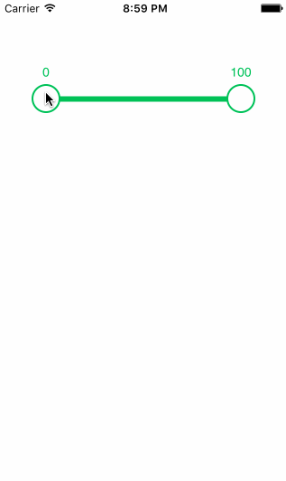

# ZMSwiftRangeSlider
A simple Range Slider library by Swift.

# Screenshot



# Setup

#### Install with [CocoaPods](http://cocoapods.org/)

```ruby
platform :ios, '8.0'
pod 'ZMSwiftRangeSlider', '~> 0.1.9'
```

#### [Example](Example/Example/ViewController.swift)

# Configuration

* `trackHeight`
* `trackTintColor`
* `trackHighlightTintColor`
* `minValueThumbTintColor`
* `maxValueThumbTintColor`
* `thumbSize`
* `thumbOutlineSize`
* `displayTextFontSize`
* `labelsAreBelow`

# API

* `func setRangeValues(_ rangeValues: [Int])`
* `func setMinAndMaxValue(_ minValue: Int, maxValue: Int)`
* `func setMinAndMaxRange(_ minRange: Int, maxRange: Int)`
* `func setValueChangedCallback(_ callback: ValueChangedCallback?)`
* `func setMinValueDisplayTextGetter(_ getter: MinValueDisplayTextGetter?)`
* `func setMaxValueDisplayTextGetter(_ getter: MaxValueDisplayTextGetter?)`

# License

[MIT](LICENSE)